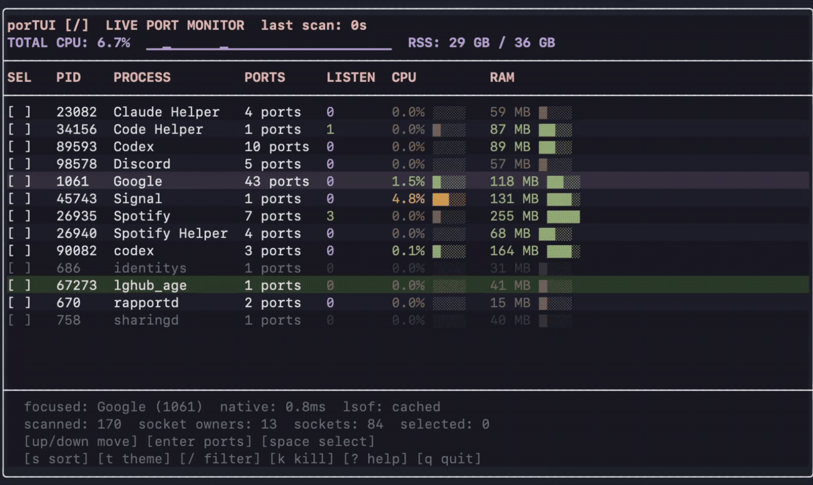
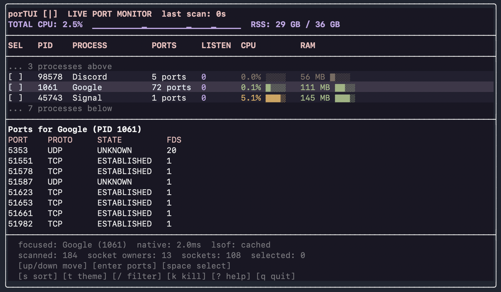

# porTUI

A live, terminal-based macOS port monitor built with C++ and FTXUI.

It groups sockets by process, shows CPU/RAM usage, supports filtering and sorting, and can terminate selected processes with confirmation.





## Requirements

- macOS
- Xcode Command Line Tools
- FTXUI: `brew install ftxui`

## Run

```sh
make run
```

Other modes:

```sh
./portui --scan
./portui --parallel-scan
./portui --benchmark
./portui --watch
```

To install a local build after compiling:

```sh
mkdir -p ~/.local/bin
cp portui ~/.local/bin/
```

## Benchmark

Measured on a local macOS machine with about 70 socket entries, across 25 warm live scans:

| Mode | Average | p50 | p99 |
| --- | ---: | ---: | ---: |
| Serial | 0.73 ms | 0.72 ms | 0.93 ms |
| Parallel | 0.39 ms | 0.39 ms | 0.44 ms |

The parallel scanner distributes `libproc` work across a persistent worker pool, with each worker collecting into its own buffer before one final merge, avoiding per-result lock contention.

Parallel scanning was `1.87x` faster in this run. Native `libproc` scans refresh every tick; the slower `lsof` coverage fallback is cached and refreshed every five seconds. Run `./portui --benchmark` for your current numbers.

## Thread Safety

`make tsan && ./portui-tsan --benchmark` completed with no ThreadSanitizer race reports on this machine.

## Controls

`up/down` move  |  `enter` show ports  |  `space` select  |  `k` terminate  |  `s` sort  |  `/` filter  |  `t` theme  |  `?` help  |  `q` quit

## License

[MIT](LICENSE)
